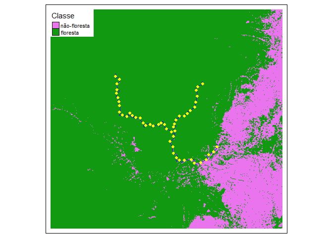

<!-- README.md is generated from README.Rmd. Please edit that file -->

# eprdados

<!-- badges: start -->

[](https://github.com/darrennorris/eprdados/actions/workflows/R-CMD-check.yaml)
[](https://app.codecov.io/gh/darrennorris/eprdados?branch=master)
[](https://github.com/darrennorris/eprdados/actions)
<!-- badges: end -->

Conjuntos de dados para o ensino de Ecologia de Paisagens.

Datasets for teaching landscape Ecology.

## Installation

You can install the development version of `eprdados` from
[GitHub](https://github.com/) with:

Você pode instalar o pacote `eprdados` através do comando:

``` r
# install.packages("remotes")
remotes::install_github("darrennorris/eprdados")
```

## Example

    #> |---------|---------|---------|---------|=========================================                                          
    #> |---------|---------|---------|---------|=========================================                                          |---------|---------|---------|---------|=========================================                                          |---------|---------|---------|---------|=========================================                                          |---------|---------|---------|---------|=========================================                                          



------------------------------------------------------------------------

This is a basic example which shows you how to make a map with the data
in the package:

``` r
library(eprdados)
library(tmap)
mapbiomas_2020 <- rast(utm_cover_AP_rio_2020)

# Reclassificação - 
# Criar uma nova camada de floresta (novo objeto de raster copiando mapbiomas_2020, 
# assim para ter os mesmos coordenados, resolução e extensão)
floresta_2020 <- mapbiomas_2020
# Todos os pixels com valor de 0
values(floresta_2020) <- 0
# Atualizar com valor de 1 quando pixels originais são de floresta (classe 3 e 4)
floresta_2020[mapbiomas_2020==3 | mapbiomas_2020==4] <- 1 
# Passo necessario para agilizar o processamento
floresta_2020_modal <- aggregate(floresta_2020, 
                                 fact=10, 
                                 fun="modal")
# pontos cada 5 km
rio_pontos_31976 <- rio_pontos |> 
  st_transform(31976) 
# linha central de rios
rio_linhacentral_31976 <- rio_linhacentral |> 
  st_transform(31976)

# Mapa
tm_shape(floresta_2020_modal) +
  tm_raster(style = "cat", 
            palette = c("0" = "#E974ED", "1" ="#129912"), legend.show = FALSE) + 
  tm_add_legend(type = "fill", labels = c("não-floresta", "floresta"),
    col = c("#E974ED", "#129912"), title = "Classe") + 
tm_shape(rio_linhacentral_31976) + 
  tm_lines(col="blue") + 
tm_shape(rio_pontos_31976) + 
  tm_dots(size = 0.2, col = "yellow") + 
tm_layout(legend.bg.color="white")
```

Package developed and built using the following guides: Fan Wang:
<https://fanwangecon.github.io/PkgTestR/articles/ffv_pkgdown_github.html>
and Emil Hvitfeldt:
<https://emilhvitfeldt.com/post/2018-09-02-usethis-workflow-for-package-development/>
